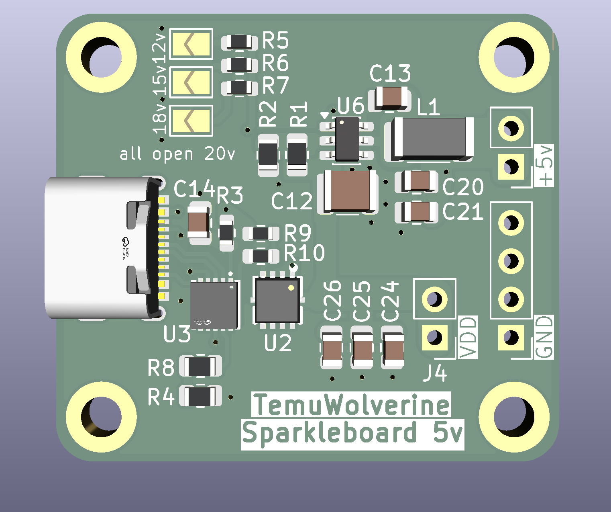

# SparkleBoard 5v (WIP)
SparkleBoard is a USB-PD power board that provides two power rails - one is user selectable from 12v, 15v, 18v or 20v (if the USB-PD power brick supports it) by using jumpers. The other power rail is 5v for microcontrollers.

Amperage defaults to 2a, can be set to 3.25a by cutting JP1

## 5v  -> 3.3v
5v rail is provided via a buck converter - [AP63205](https://www.diodes.com/part/view/AP63205), an inexpensive fixed voltage buck converter from Diodes.

If you wanted 3.3v, this could be achieved by swapping out the chip for the AP63203, and changing the inductor to 3.9uH (from 4.7uH). The rest of the circuit design remains the same according to the manufacturer.

> Note: the AP63200/AP63201 are not fixed voltage output IC's and require additional circuitry with different values and are **NOT** drop in replacements.

## Datasheets
* [AP63205](https://www.diodes.com/datasheet/download/AP63200-AP63201-AP63203-AP63205.pdf)
* [HUSB238](https://www.hynetek.com/uploadfiles/site/219/news/aabbbbdb-48c9-4a44-a6dc-2c15f53282e6.pdf)

## References
* [Sparkfun Babybuck](https://github.com/sparkfun/Buck_Regulator_AP63203/tree/main) (AP6320***3***)
* [Adafruit HUSB238 breakout board](https://github.com/adafruit/Adafruit-USB-Type-C-Power-Delivery-Dummy-Breakout-PCB/tree/main)
